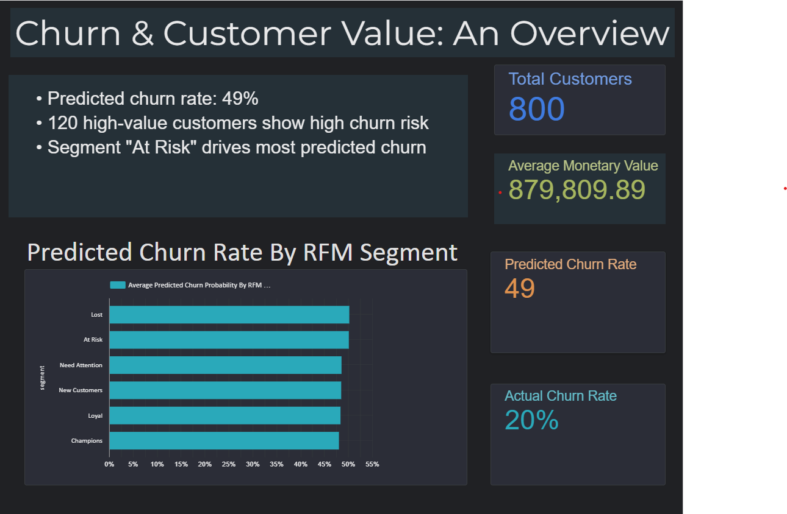

# 📂 Portfolio Hub: Customer Value & Churn Insights

---

## 📊 What This Repository Contains

This hub connects output from multiple sub-projects in my data science portfolio:

- 🔁 **RFM Segmentation** — Customer value analysis based on Recency, Frequency, and Monetary metrics
- 📉 **Churn Prediction** — Machine learning models predicting customer churn with varying imbalance scenarios
- 🧠 **BigQuery + Looker Studio** — Visual analytics and business-facing KPIs hosted in the Google Cloud ecosystem

All simulations were designed to reflect realistic patterns in e-commerce customer behavior, using reproducible Python pipelines.

---

## 📌 Dashboard KPIs (Connected via BigQuery)

The Looker Studio dashboard includes:

- ✅ Total customers
- 💰 Average Monetary Value
- ⚠️ Predicted Churn Rate (ML)
- 🔄 Actual Churn Rate (Label)
- 📊 RFM Segment breakdown vs. Churn
- 🎯 Segmented Customer Value & Risk

---

## 🛠 How It Works

1. **Simulated datasets** were generated in the RFM and Churn sub-repositories  
2. **ML & scoring pipelines** export cleaned outputs as `.csv`  
3. This repo **joins and uploads** the merged dataset to BigQuery  
4. A **Looker Studio dashboard** is built on top for interactive storytelling

---

## 🧪 Sub-Repositories

| Project | Description |
|--------|-------------|
| [`rfm-segmentation`](https://github.com/Essejran/rfm-segmentation) | Customer value scoring using RFM metrics |
| [`churn-prediction`](https://github.com/Essejran/churn-prediction) | Logistic Regression + XGBoost models across 3 churn scenarios |
| [`A-B-Testing`](https://github.com/Essejran/A-B-Testing) *(optional)* | A/B test significance testing & Bayesian analysis |
| **This repo** | Integration layer for dashboards and KPIs

---

## 🚀 Next Steps

- Add time-series filtering and customer drilldowns
- Integrate campaign response modeling or uplift scores
- Extend with cohort retention or CLV estimation

---

📬 *This project is part of a strategic portfolio tailored for data science & analytics roles in e-commerce and SaaS.*

